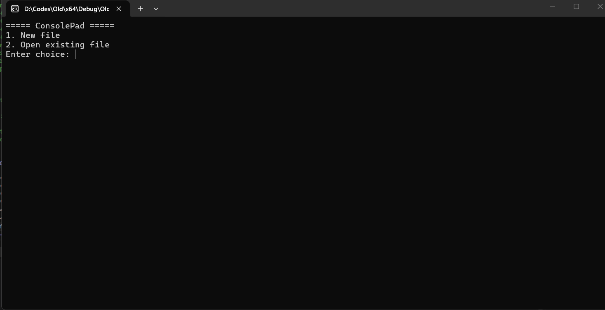
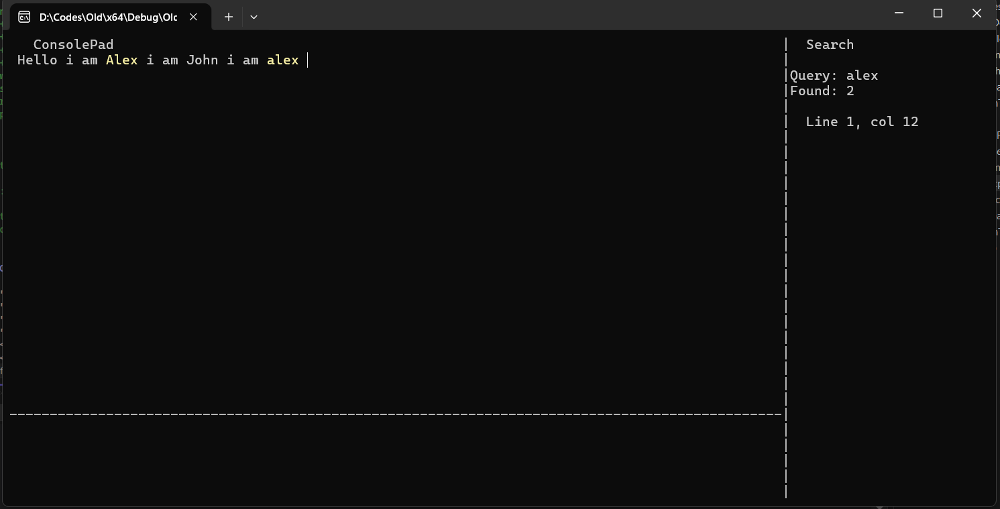
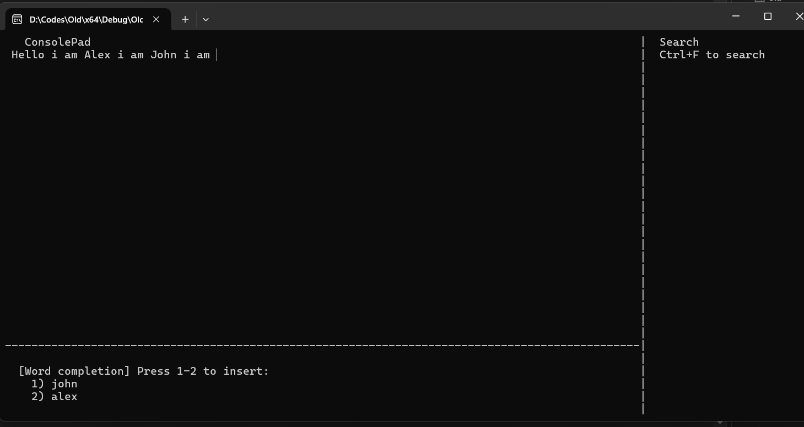

# ConsolePad

A console-based text editor written in C++ that runs entirely inside a Windows terminal. Built as a data-structures deep-dive: every core feature — editing, search, and word prediction — is backed by a custom data structure rather than the standard library.

---

## Features

| Feature | Detail |
|---|---|
| **2-D linked-list document model** | Every character lives in a doubly-linked grid. Horizontal links connect characters within a line; vertical links connect the same column position across lines. |
| **Operation-based undo / redo** | Up to 50 operations. Each record stores only the delta (character + position), not a document snapshot. |
| **Trie-powered full-text search** | N-Ary trie (26 children per node) indexes every word in the document. Single-word and multi-word phrase search in O(k) trie time, then occurrence iteration. |
| **Word-prefix completion** | `@` trigger: collects all trie words sharing the typed prefix via DFS. |
| **Bigram next-word prediction** | `*` trigger: a second trie indexes consecutive word pairs (bigrams). The top-N most-frequent successors of the last typed word are offered as ranked suggestions. |
| **Search highlighting** | Matched characters are rendered in yellow using `SetConsoleTextAttribute`. Highlights clear on the next edit. |
| **Partial rendering** | Only the affected row (or rows, after a merge/split) is redrawn, not the full screen. |
| **File I/O** | Load and save plain-text files. New files are created automatically. Prompted save on exit. |

**Key bindings**

```
Ctrl+S      Save
Ctrl+Z      Undo
Ctrl+Y      Redo
Ctrl+F      Search (type query, Enter to confirm)
Arrows      Move cursor
Backspace   Delete left / merge lines
Enter       New line
Escape      Exit (save prompt)
@           Word-completion suggestions
*           Next-word prediction suggestions
1–9         Accept suggestion
```

---

## Architecture

### Document model — 2-D doubly-linked list

```
sentinel─► c─► o─► n─► s─► o─► l─► e
   │                               │
   ▼                               ▼
sentinel─► p─► a─► d
```

Every row begins with a sentinel node whose `data` is `'\n'`. Characters within a row are linked left↔right. Corresponding column positions across rows are linked up↔down. This makes vertical cursor movement, line merge, and line split all local pointer operations — no array shifting.

### SearchTrie

```
root
 └─ c
     └─ o
         └─ n  ← isWordEnd, OccurrenceList → {row:0, docNode:*}
         └─ s
             └─ o
                 └─ l
                     └─ e  ← isWordEnd, OccurrenceList → {row:0, docNode:*}
```

Each `TrieNode` stores an `OccurrenceList` — a singly-linked list of `(Node*, row)` pairs pointing back into the 2-D grid. Search reaches the terminal node in O(k), then iterates occurrences. For phrase search it verifies subsequent words starting from each first-word occurrence.

### BigramPredictor

A second N-Ary trie keyed on the context word. Each terminal node holds a `FollowerList` of `(word, frequency)` pairs. On every word-boundary edit the trie is rebuilt in one O(n) pass; `topN()` does a simple selection over the (small) follower list.

```
"the" → { "quick": 3, "big": 1, "lazy": 2 }
"quick" → { "brown": 2, "fox": 1 }
```

Pressing `@` after typing `the` yields: `quick`, `lazy`, `big`.

### Undo / Redo

`UndoStack` is a fixed-capacity (50) singly-linked list acting as a stack. Each record stores the `OpType` and the minimal information needed to reverse it:

| OpType | Stored data | Undo action |
|---|---|---|
| `OP_INSERT` | char, row, col | navigate → delete |
| `OP_DELETE` | char, row, col | navigate → insert |
| `OP_NEWLINE` | row, col | navigate to new row → merge |
| `OP_MERGE` | row, mergeCol | navigate → split |

### Rendering

The console is divided into three panels at startup. Only the panels that change are redrawn:

- `displayRow(r)` — redraws a single row after a character insert/delete.
- `displayFrom(r)` — redraws from row `r` downward after a line split/merge.
- `display()` — full repaint (used only on load and after undo of structural ops).

---

## File structure

```
ConsolePad/
│
├── include/
│   ├── Node.h              Core node type, UndoRecord, UndoStack declarations
│   ├── Notepad.h           Notepad class declaration
│   ├── SearchTrie.h        SearchTrie, MatchList, TrieNode declarations
│   ├── BigramPredictor.h   BigramPredictor, FollowerList declarations
│   └── UI.h                All rendering & panel function declarations
│
├── src/
│   ├── Main.cpp            Input loop and application orchestration
│   ├── Node.cpp            UndoStack implementation
│   ├── Notepad.cpp         Document editing, cursor, rendering, file I/O
│   ├── SearchTrie.cpp      Trie build, search, prefix completion
│   ├── BigramPredictor.cpp Bigram build and next-word suggestion
│   └── UI.cpp              Console primitives, panel rendering, highlights
│
├── screenshots/
└── README.md
```

---

## Screenshots

### Main Menu


### Search Panel


### Suggestion System



## Building

Requires: **MSVC** (Visual Studio 2019 or later) on Windows.

**Visual Studio:**
1. Create a new empty C++ project.
2. Add all files under `src/` as source files and `include/` as the include directory.
3. Build → Run.

**Command line (MSVC):**
```
cl /std:c++17 /W4 /I include src\*.cpp /Fe:ConsolePad.exe
```

> The project uses `<Windows.h>` for console I/O (`ReadConsoleInput`, `SetConsoleCursorPosition`, `SetConsoleTextAttribute`). It is Windows-only by design.

---

## Known limitations

- **Windows only.** The rendering layer calls Win32 console APIs directly. Porting to POSIX would require replacing those calls with ncurses or equivalent.
- **Full trie rebuild on each word boundary.** Rebuilding is O(n) per word typed, which is acceptable for documents that fit on screen. An incremental update strategy (insert/remove individual words) would improve performance on very large files.
- **No mouse support.** Cursor movement is keyboard-only.
- **Fixed 26-child trie alphabet.** Non-ASCII characters in the source file are treated as word separators and are not indexed.

---

## Background

Built for CS218 Data Structures (Fall 2024). The bigram predictor was originally named *ChilliMilliTree* in the assignment spec — the name has been replaced with `BigramPredictor` for clarity, but the underlying structure is faithful to the original design.
